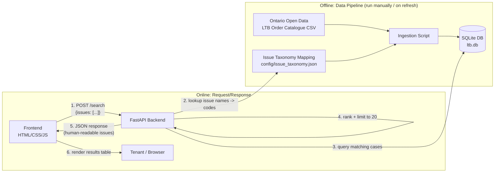

# MVP 0 Architecture

This describes how the pieces of the LTB Case Discovery Tool fit together for MVP 0, per `docs/mvp0/plan.md` and the tech stack chosen in `docs/mvp0/tasks.md` (FastAPI + SQLite + vanilla HTML/CSS/JS).

---

## 1. High-Level Overview



There are two independent lifecycles:

* **Offline data pipeline** — run whenever the catalogue is refreshed. Produces the SQLite database. Never runs during a user request.
* **Online request/response** — the FastAPI backend only ever reads the already-built SQLite database; it never touches the raw catalogue file.

---

## 2. Components

### 2.1 Data Pipeline (offline)

Turns the raw Ontario Open Data catalogue into the SQLite database used at request time.

| Step | Input | Output | Notes |
| --- | --- | --- | --- |
| Acquire catalogue | Ontario Open Data portal | `data/raw/ltb_orders.csv` | Snapshot, versioned with a download-date note (Task 2) |
| Define taxonomy | LTB website's list of application categories | `config/issue_taxonomy.json` | Maps the 6 user-facing issue names ↔ official LTB codes (Task 3) |
| Clean columns | `data/raw/ltb_orders.csv` | in-memory cleaned rows | For each bilingual `English / French` column header, keep only the text before `/` (inclusive of the `/`); rename `ContentDownload URL` → `View Order` (Task 5) |
| Load into DB | cleaned rows | `data/ltb.db` (raw table) | Re-runnable: clears and reloads on each run (Task 5) |
| Normalize issue codes | raw issue code field (e.g. `T1;T2;T3`) | normalized code storage | Parsed into a queryable form — join table or consistent delimiter (Task 6) |

Implemented as a standalone script (not part of the FastAPI app process), invoked manually or via a future scheduled job.

### 2.2 Database (SQLite)

Single file, `data/ltb.db`. One table (or a table + issue-code join table, depending on Task 6's outcome) holding only the fields required by MVP 0:

* File Number
* Order Date
* Issue Code(s)
* City
* Document Type
* View Order (document URL)

No user data, no auth tables — nothing beyond what's needed to serve `/search`. Schema lives in a SQL file per Task 4.

### 2.3 Backend (FastAPI)

The only component that reads the SQLite database and the only component the frontend talks to.

Proposed module breakdown:

```
backend/
  main.py              # FastAPI app, route registration, GET /health
  schemas.py           # Pydantic request/response models
  taxonomy.py          # loads config/issue_taxonomy.json; name <-> code lookup (Task 8)
  queries.py           # DB access: filter-by-codes (ALL match / ANY match) (Task 9)
  ranking.py           # combine + sort + cap results at 20 (Task 10)
  routes/
    search.py          # POST /search endpoint, wires taxonomy + queries + ranking (Task 11)
```

Responsibilities (per `plan.md` section 8):
* Map user-selected issue names → LTB application codes
* Filter cases in SQLite by those codes
* Rank: all-selected-codes matches first (by most recent order date), then any-match fallback, capped at 20
* Map codes back to human-readable issue names in the response
* Never expose the SQLite database directly to the frontend

### 2.4 Frontend (static HTML/CSS/JS)

```
frontend/
  index.html   # issue checkboxes + Search button + results table container (Task 12)
  app.js       # fetch POST /search, handle response, render table (Tasks 13-14)
  styles.css   # basic styling (Task 9 of plan.md)
```

No build step, no framework, no direct database access — only calls `POST /search` and renders whatever JSON comes back. Also owns the no-results message and the legal disclaimer (Task 15).

---

## 3. Request Lifecycle (a single search)

1. Tenant checks one or more issue checkboxes in `index.html` and clicks **Search**.
2. `app.js` sends `POST /search` with the selected user-facing issue names as JSON.
3. FastAPI's `search` route (`routes/search.py`) receives the request, validated against a Pydantic model.
4. `taxonomy.py` converts the selected issue names into their LTB application codes.
5. `queries.py` runs two queries against `ltb.db`: cases matching **all** codes, then (if needed) cases matching **any** code.
6. `ranking.py` merges those result sets — all-match first, both sorted by most recent order date — and caps the combined list at 20.
7. The route maps each result's codes back to human-readable issue names and returns JSON.
8. `app.js` renders the response into the results table (File Number, Order Date, Issues, City, Document Type, View Order), or shows the "no results" message if the list is empty.
9. Clicking **View Order** opens the document URL from the catalogue directly — the app never fetches or stores the order PDF itself.

---

## 4. Explicit Non-Goals (architectural)

Consistent with `plan.md` section 11 — these have no place in the MVP 0 architecture:

* No PDF/text processing, OCR, or CanLII integration components
* No LLM, TF-IDF, or similarity-ranking components
* No auth/session layer, no user data store
* No frontend build pipeline or JS framework
* The frontend never queries SQLite directly — FastAPI is the only path to the data
