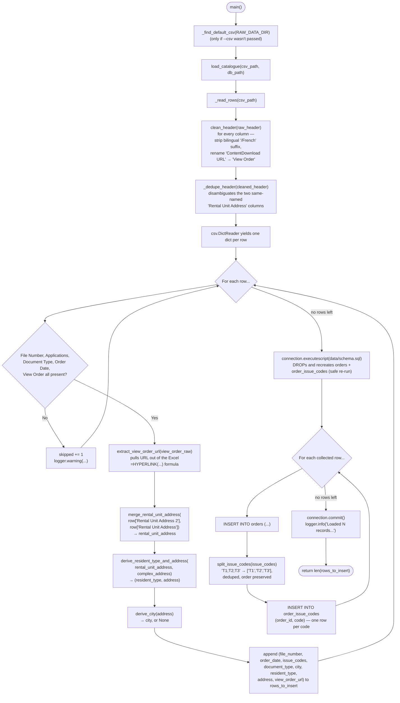
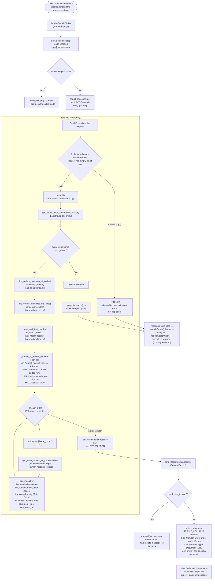

# MVP 0 Process Map

Task 18. Where `docs/mvp0/architecture.md` describes the system at the
component level (and at the design stage, before some of it was built),
this doc traces actual, current function calls — file by file — so you
can answer "what code runs when X happens?" without reading every file
yourself. Keep this in sync with the code as it changes; if a function
here gets renamed, moved, or removed, update the diagram in the same
commit.

Two flows are covered: the offline data pipeline (run manually, never
during a request) and a tenant's search (everything that happens between
clicking **Search** and seeing a table or a "no results" message).

---

## 1. Data Pipeline: raw CSV → `data/ltb.db`

Entry point: `.venv/Scripts/python.exe scripts/ingest_catalogue.py`. Every
box below is a function in `scripts/ingest_catalogue.py` unless labeled
otherwise.

**Where things can go sideways:** a row missing any required field is
skipped, not inserted (`ReqCheck` above) — it's counted but never reaches
the DB. Everything else in a row is best-effort: `derive_city` returns
`None` rather than raising when it can't find a city segment, and
`derive_resident_type_and_address` returns `("", "")` rather than raising
when neither address column has anything.

---

## 2. A Tenant's Search, Start to Finish

Entry point: clicking **Search** (`#search-button` in `frontend/index.html`).

**The three branch points called out in Task 18, concretely:**

* **No issues selected** — caught client-side in `handleSearchClick()`
  (`IssuesEmpty`). No request ever reaches the backend.
* **An issue name `/search` doesn't recognize** — `get_codes_for_issues()`
  raises `ValueError`, which `search()` turns into an HTTP 400. The
  frontend's `fetch` sees `response.ok === false`, throws, and the error
  lands in `console.error` — nothing renders.
* **Zero matching cases** — `rank_and_limit_results()` returns `[]`,
  `SearchResponse.results` is `[]`, and `renderResults([])` shows the
  "No matching orders found." message (Task 15) instead of a table.
